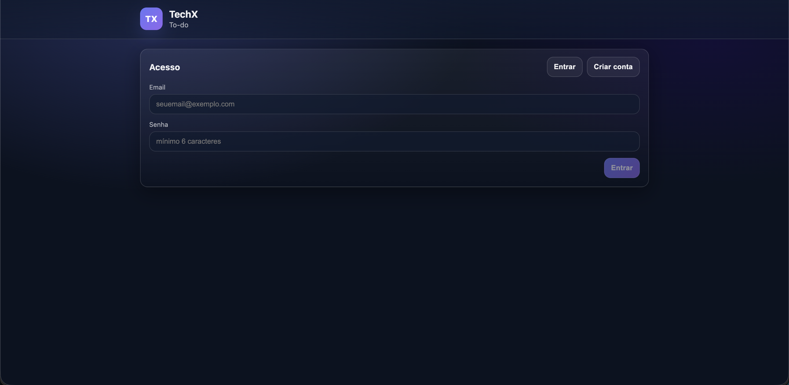
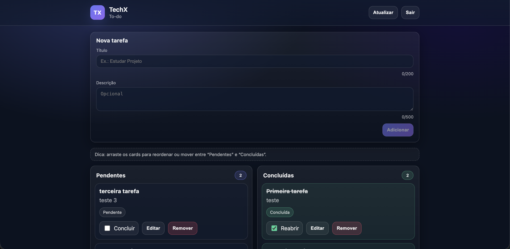

# desafio-essentia-tecnologies

# TechX - To Do List

## Tecnologias
- Angular
- Node.js
- TypeScript
- MySQL
- Prisma ORM
- JWT (Auth)
- Docker Compose

## Variáveis de ambiente
- Copie o arquivo `.env.example` para `.env` na raiz do diretório `desafio-essentia-tecnologies`.
- Copie o arquivo `.env.example` para `.env` na raiz do diretório `backend`.

## Como rodar o projeto de forma automatizada

## Como rodar macOS
na raiz do diretório `desafio-essentia-tecnologies`, execute:
```bash
docker compose --env-file .env up -d --build \
  && until curl -fsS http://localhost:3000/health >/dev/null; do sleep 1; done \
  && until curl -fsS http://localhost:4200/ >/dev/null; do sleep 1; done \
  && open http://localhost:4200/
```
## Como rodar Linux
na raiz do diretório `desafio-essentia-tecnologies`, execute:
```bash
docker compose --env-file .env up -d --build \
&& until curl -fsS http://localhost:3000/health >/dev/null; do sleep 1; done \
&& until curl -fsS http://localhost:4200/ >/dev/null; do sleep 1; done \
&& xdg-open http://localhost:4200/
```

## Como rodar manualmente 

## Como rodar o banco de dados
na raiz do diretório `desafio-essentia-tecnologies`, execute:
```bash
docker compose --env-file .env up -d
```
## Como rodar o backend
```bash
cd backend
npm install
npm run prisma:migrate
npm run dev
```

## Como rodar o frontend
```bash
cd frontend
npm install
npm start
```
- Y e tecla enter, para aceitar as mudanças no arquivo `angular.json`
## Imagens





